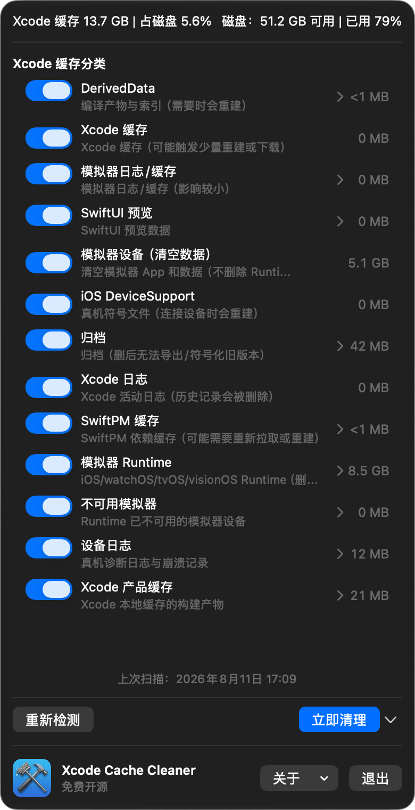
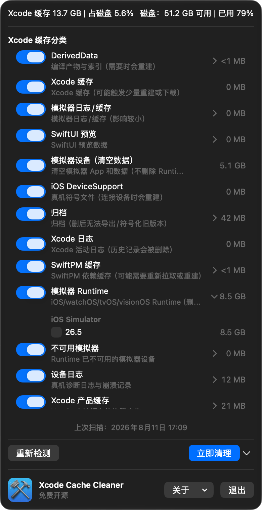
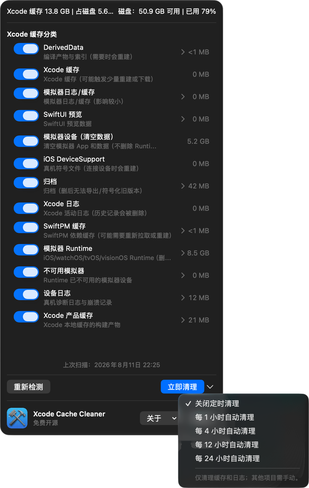

# Xcode Cache Cleaner

Xcode 的缓存、模拟器和归档会在开发过程中持续增长，最终可能把磁盘空间占满。<br>
Xcode caches, simulator data, and archives grow over time and can eventually fill your disk.

Xcode Cache Cleaner 是一个免费、开源、只在本机运行的 macOS 菜单栏工具，帮助你看清空间去了哪里，并在删除前做出选择。<br>
Xcode Cache Cleaner is a free, open-source macOS menu bar utility that shows where the space goes and lets you choose what to remove.

[下载 DMG / Download DMG](https://github.com/yicheng2031/XcodeCacheCleaner/releases/latest) · [项目主页 / Website](https://yicheng2031.github.io/XcodeCacheCleaner/) · [隐私 / Privacy](./PRIVACY.md) · [反馈 / Issues](https://github.com/yicheng2031/XcodeCacheCleaner/issues)

## 为什么需要它 / Why this project

DerivedData、Simulator Runtime、模拟器设备数据、DeviceSupport、归档、日志和 SwiftPM 缓存，常常比项目源码更快地占满磁盘。<br>
DerivedData, Simulator Runtimes, simulator data, DeviceSupport, archives, logs, and SwiftPM caches can consume more space than your source code.

很多清理方式只有一个“删除全部”按钮，无法区分可重建缓存和需要谨慎保留的开发资产。<br>
Many cleanup tools offer only a “delete everything” button and do not distinguish rebuildable caches from development assets worth keeping.

这个项目的目标是让 Xcode 存储变得可见、可选择、可复查。<br>
The goal is to make Xcode storage visible, selective, and reviewable.

## 适合谁 / Who it is for

它适合刚开始学习 iOS 开发、还不熟悉 Xcode 缓存目录的新开发者。<br>
It is useful for new iOS developers who are still learning what Xcode stores and where it stores it.

它也适合使用 256 GB 或 512 GB SSD、安装多个 Runtime、经常切换项目或需要保留多个归档版本的开发者。<br>
It is also useful for developers on 256 GB or 512 GB SSDs, developers with multiple Runtimes, and anyone who switches projects or keeps several archives.

如果你想在终端命令和“盲删全部”之间找到一个更容易理解的方案，这个工具就是为你准备的。<br>
If you want something clearer than Terminal commands but safer than blindly deleting everything, this tool is for you.

## 产品截图 / Screenshots

<p align="center">
  
  
  
</p>

菜单栏总览显示 Xcode 缓存总量、磁盘占用比例、各分类大小，以及重新检测和立即清理入口。<br>
The menu bar view shows total Xcode storage, disk usage, category sizes, Rescan, and Clean Now.

Runtime、归档等内容可以展开后逐项选择，定时清理也有独立的频率菜单。<br>
Runtimes and archives can be expanded for item-level selection, and scheduled cleanup has its own frequency menu.

## 能清理什么 / What it cleans

### 可重建缓存和日志 / Rebuildable caches and logs

DerivedData、Xcode 缓存、模拟器日志与缓存、SwiftUI 预览、SwiftPM 缓存、设备日志和 Xcode 产品缓存。<br>
DerivedData, Xcode caches, Simulator logs and caches, SwiftUI previews, SwiftPM caches, device logs, and Xcode product caches.

这些内容可以参与定时清理，但仍然受分类开关和具体项目选择控制。<br>
These categories can participate in scheduled cleanup, subject to your category switches and item selections.

### 需要手动确认的内容 / Manual-only items

Simulator Runtime、Xcode 归档、不可用模拟器、iOS DeviceSupport，以及“清空全部模拟器数据”。<br>
Simulator Runtimes, Xcode archives, unavailable simulators, iOS DeviceSupport, and Erase All Simulator Data.

它们可能很大，但删除后可能需要重新下载、重新构建，或导致已有开发环境和数据消失。<br>
They can be large, but deletion may require downloads or rebuilds and can remove existing development data.

## 如何使用 / How to use it

1. 下载 DMG，将应用拖入 Applications，然后从菜单栏打开。<br>
   Download the DMG, move the app to Applications, and open it from the menu bar.
2. 点击“重新检测”，查看当前磁盘和 Xcode 分类大小。<br>
   Click Rescan to inspect current disk usage and Xcode categories.
3. 用分类开关选择普通缓存；展开 Runtime、归档或列表分类，检查具体项目。<br>
   Use category switches for ordinary caches, and expand Runtimes, archives, or lists to review individual items.
4. 点击“立即清理”，应用会执行操作并重新扫描。<br>
   Click Clean Now; the app performs the cleanup and scans again.

### Runtime 清理 / Runtime cleanup

默认策略是每个平台保留最新的 Runtime，并把更旧且可删除的版本作为候选项。<br>
The default policy keeps the newest Runtime for each platform and marks older deletable versions as candidates.

应用使用 Runtime 标识符执行删除，并继续验证 Runtime 列表和挂载状态。<br>
The app deletes by Runtime identifier and verifies the runtime list and mount state afterward.

如果验证超时，界面会显示具体原因，并提供可复制到终端的兜底命令。<br>
If verification times out, the UI shows the reason and provides fallback commands for Terminal.

### 定时清理 / Scheduled cleanup

可以选择关闭，或每 1、4、12、24 小时执行一次。<br>
Choose Off, or run cleanup every 1, 4, 12, or 24 hours.

启用后应用会注册登录启动项，并在每次执行前重新扫描当前状态。<br>
When enabled, the app registers a login item and rescans the current state before each run.

定时清理只处理可重建缓存和日志，不会自动删除 Runtime、归档、不可用模拟器、DeviceSupport 或模拟器全部数据。<br>
Scheduled cleanup only handles rebuildable caches and logs; it never automatically deletes Runtimes, archives, unavailable simulators, DeviceSupport, or all simulator data.

## 删除前请注意 / Before you delete

删除的归档、模拟器数据和 Runtime 不能通过本工具恢复。<br>
Deleted archives, simulator data, and Runtimes cannot be restored through this tool.

如果 Xcode、Simulator 或构建任务正在运行，建议先关闭它们，再执行大规模清理。<br>
Close Xcode, Simulator, or active build tasks before a large cleanup when possible.

“模拟器设备数据”和“模拟器 Runtime”不是同一件事：前者清空 App 和用户数据，后者删除已安装的系统 Runtime。<br>
Simulator device data and Simulator Runtimes are different: the former erases apps and user data, while the latter removes installed simulator operating systems.

本项目不会删除你的源码、Git 仓库或项目目录中的业务文件。<br>
This project does not delete your source code, Git repositories, or application files inside your project directories.

## 常见问题 / FAQ

### 定时清理会删除 Runtime 吗？ / Will scheduled cleanup delete Runtimes?

不会，Runtime、归档、不可用模拟器、DeviceSupport 和模拟器全部数据始终需要手动操作。<br>
No. Runtimes, archives, unavailable simulators, DeviceSupport, and all simulator data always require manual action.

### Runtime 已经消失，为什么仍然提示失败？ / Why can a Runtime still show an error after it disappears?

系统可能在命令返回后继续卸载挂载内容，应用会等待并验证；只有验证真正超时才会报告 Runtime 验证失败。<br>
The system may continue removing mounted content after the command returns, so the app waits and verifies; only a real timeout is reported as Runtime verification failure.

`simctl erase all` 属于模拟器设备数据清理，失败时会单独显示，不会再误报成 Runtime 删除失败。<br>
`simctl erase all` belongs to simulator-data cleanup and is reported separately instead of being mislabeled as Runtime deletion failure.

### 应用会上传数据吗？ / Does the app upload data?

不会，扫描、清理和定时任务都在本机执行，不需要账号、云同步、分析统计或追踪。<br>
No. Scanning, cleanup, and scheduled tasks run locally with no account, cloud sync, analytics, or tracking.

## 兼容性与开发 / Compatibility and development

支持 macOS 13 或更高版本，发布脚本会生成同时支持 Apple Silicon 和 Intel 的 Universal 2 DMG。<br>
The project supports macOS 13 or later, and the release script creates a Universal 2 DMG for Apple Silicon and Intel.

开发环境需要 macOS 13+ 和 Xcode 15+。<br>
Development requires macOS 13+ and Xcode 15+.

```bash
# Build and launch Debug
./script/build_and_run.sh

# Build, launch, and verify the process
./script/build_and_run.sh --verify

# Create a Universal 2 DMG
./script/package_release.sh
```

发布文件会写入 `dist/`。<br>
Release artifacts are written to `dist/`.

## 隐私与许可证 / Privacy and license

应用只在本机读取和处理开发者目录，不收集、上传、出售或分享个人数据。<br>
The app processes developer directories locally and does not collect, upload, sell, or share personal data.

详细说明请查看 [PRIVACY.md](./PRIVACY.md)，项目使用 [MIT License](./LICENSE)。<br>
See [PRIVACY.md](./PRIVACY.md) for details; the project is released under the [MIT License](./LICENSE).
